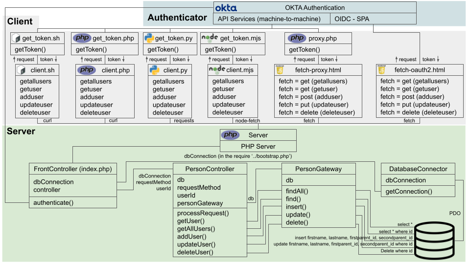

# php rest api with okta authentication
<h2>Purpose</h2>
This work is the implementation of a <a href="https://developer.mozilla.org/en-US/docs/Glossary/CRUD">CRUD</a> REST API created in PHP without a framework. The basis for this is the Okta article <a href="https://developer.okta.com/blog/2019/03/08/simple-rest-api-php">Build a Simple REST API in PHP</a>. An account in Okta is necessary for the authentication portion. 
<h2>Architecture</h2>
It has a database and a server-side PHP application to provide a REST API functionallity to clients written in PHP, Bash, Python, Node, HTML/Javascript (with a proxy written in PHP) and HTML/Javascript with Oauth2 / OpenID Connect. 
Authentication is done with the use of bearer tokens provided by <a href="https://developer.okta.com/">Okta</a>. For a version of the REST API without authentication, please refer to <a href="https://github.com/adriano-pinaffo/php_rest_api">this project</a>. 
This system simulates the registering of persons on a database. 
 
The following diagram shows all the clients on top, the server-side on the bottom part and Okta authentication above the clients.
<figure>

<figcaption>REST API Architecture diagram</figcaption>
</figure>
 
<h2>Authentication</h2>

The front controller authenticates the clients using the <code>authenticate</code> function. It will strip the client's Authorization request header and extract the bearer token. The token is of type <a href="https://datatracker.ietf.org/doc/html/rfc7519">JSON Web Token (JWT)</a> and it will contain the client ID inside (in the payload portion of the token). That will be also saved to verify the token. The reason is that this REST API server may authenticate different types of clients, including "machine-to-machine" and "Single Page Applications (SPA)" authentication, which have distinct client IDs.  
The <code>authentication</code> function will then use Okta's <code>JwtVerifier</code> object to verify the token. Once verified, the front controller will process the request. In case verification fails the client will get back a <code>401 Unauthorized</code> HTTP response.

<h2>Components</h2>
The server is composed of four parts:
<ul>
    <li><b>FrontController</b>: implemented in the <i>index.php</i>, it validates and authenticates the request. Then, the FrontController processes it by calling the PersonController's processRequest method.</li>
    <li><b>DatabaseConnector</b>: implemented in <i>DatabaseConnector.php</i> and called by <i>bootstrap.php</i>, which will be imported (<i>require</i>d) by index.php, it opens the connection to the database. The database parameters are located in the .env local file, and are loaded by <a href="https://github.com/vlucas/phpdotenv">phpdotenv</a></li>
    <li><b>PersonController</b>: implemented in <i>PersonController.php</i>, it instantiates the PersonGateway to handle the database processes. It also implements the method verification, data validation/sanitization. Depending on the HTTP method a different method from PersonGateway is invoked.</li>
    <li><b>PersonGateway</b>: implemented in <i>PersonGateway.php</i>, it is the "model" that handles database activities. It implements the methods with <a href="https://www.php.net/manual/en/pdo.prepared-statements.php">PDO prepare</a> to protect the database from SQL injection.</li>
</ul>
<h2>How to use it</h2>
<ul>
<li>Be sure to have PHP installed.
<li>Clone this repository, enter in the root folder and run <code>php -S 127.0.0.1:8000 -t public</code> (it can be run as well with any Web server, or in the background by forking with <code>&</code> or <code>nohup</code>).
<li>If using the test with proxy, the proxy code must be run with <code>php -S 127.0.0.1:8001 src/Proxy/proxy.php</code>.
</ul>
<h2>Clients</h2>
Six types of clients are available to work as an API client. As for the clients, please go to the <a href="https://github.com/adriano-pinaffo/php_rest_api_with_okta/tree/master/client">client section</a> to see examples and how to use them.
