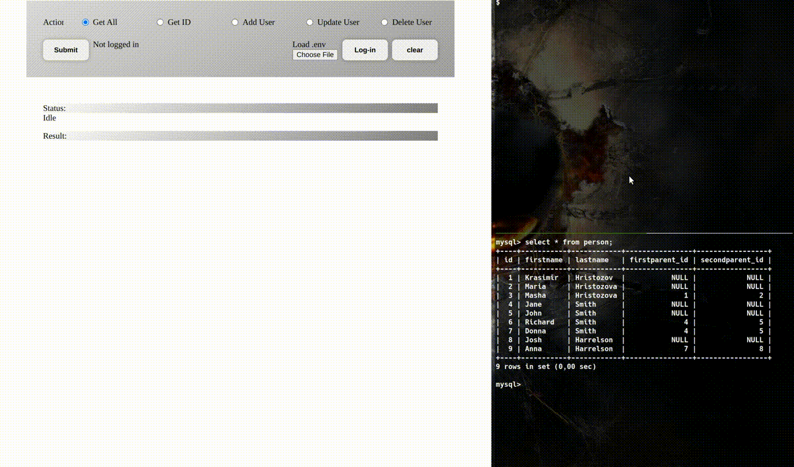

# clients for the php rest api with okta authentication
<ul>
    <li><a href="#principle">Principle</a></li>
    <li><a href="#clients">Clients</a></li>
    <ul>
        <li><a href="#oauth2">HTML/Javascript with Oauth2 / OpenID Connect</a></li>
        <li><a href="#proxy">HTML/Javascript with Proxy</a></li>
        <li><a href="#php">PHP client</a></li>
        <li><a href="#bash">Bash client</a></li>
        <li><a href="#python">Python client</a></li>
        <li><a href="#node">Node client</a></li>
    </ul>
</ul>
<h2 id="principle">Principle</h2>
All of the clients first start a process to get the bearer token from Okta. All of the clients (except for the HTML/Javascript clients) have their get_token counterpart to handle communication with Okta to get the token (an application integration of type "API Services - machine to machine authentication" must have been created in Okta platform). Client ID and secret are loaded from .env local file, the same one that has the server database parameters.
  
When in production, the client should, obviously, have key and secret information located in a different place from the server's database parameters. You can have an overview below of the different types of clients.
<h2 id="clients">Clients</h2>
<h3 id="oauth2">HTML/Javascript + Oauth 2.0 / OpenID Connect</h3>

Client written using HTML form elements and Javascript. This client will make use of <a href="https://oauth.net/2/">Oauth</a> / <a href="https://openid.net/connect/">OpenID Connect</a> to authenticate the user before getting the bearer token. This differs from the other solutions as it will not make use of the client ID and secret in the .env file. Because of that, a different type of application (Single Page App - SPA) needs to be created in Okta platform. In order to have Username and Password fields this clients makes use of <a href="https://developer.okta.com/docs/guides/embedded-siw/main/">Okta Sign-In widget</a>. Alternatively, one can fully customize the login window. This client also makes use of the <a href="https://github.com/okta/okta-auth-js/">Okta Auth Javascript SDK</a> for authentication purposes.  
This client will instantiate the <code>OktaSignIn</code> class, which will have all of the properties and methods to handle authentication. Once logged-in the bearer token is placed in the <a href="https://developer.mozilla.org/fr/docs/Web/API/Window/localStorage">localStorage</a>. All of the actions can be handled by the OktaSignIn instantiated object.  
To communicate with the REST API application the client will make requests with fetch, which will have the Authorization header set up with the bearer token (here known as access token), which was retrieved from the localStorage using the <code>oktaSignIn.authClient.getAccessToken</code> method. As with the proxy case, the REST API server needs to handle <a href="https://developer.mozilla.org/en-US/docs/Glossary/Preflight_request">preflights</a> since fetch packets here are formed with non-standard headers and possibly unsafe HTTP methods (PUT and DELETE).

<h4>How to use</h4>

This page needs to be open in a HTTP Server. Any HTTP Server will do, even <a href="https://github.com/ritwickdey/vscode-live-server">VSCode Live Server</a>, <a href="https://github.com/tamago324/vim-browsersync">vim-browsersync</a>, or any embedded web server in any popular language like <a href="https://docs.python.org/3/library/http.server.html">Python</a>, <a href="https://www.php.net/manual/en/features.commandline.webserver.php">PHP</a>, <a href="https://nodejs.org/api/http.html#httpcreateserveroptions-requestlistener">Node</a>, etc. Also, Okta application configuration needs to do a callback to the client address started by the web server.

<h3 id="proxy">HMTL/Javascript + Proxy</h3>

Client written using HTML form elements and Javascript. To circumvent the fact that a client in the browser cannot directly request tokens to Okta's authorization servers, it will make use of a proxy server to make this request on its behalf. This solution does not implement Oauth / OpenID Connect, for that, refer to the <a href="#oauth2">specific section</a>. As with the other clients, the user must load the client ID and secret from the .env file (or it can be typed manually in the input fields). For this to work, the proxy application (proxy.php) must be running. Run it with <code>php -S 127.0.0.1:8001 src/Proxy/proxy.php</code>.  
In order to get the bearer token, the javascript <code>getToken</code> function requests it (through <a href="https://developer.mozilla.org/en-US/docs/Web/API/Fetch_API">fetch</a>) to the proxy. This will prompt the Proxy to forward the client ID and secret to Okta to get the token, which will be returned to the fetch (if successful). Javascript will then store the token in the input field "url" as a <a href="https://developer.mozilla.org/en-US/docs/Web/HTML/Global_attributes/data-*">custom data attribute</a> (a developer can change this and store it in the <a href="https://developer.mozilla.org/fr/docs/Web/API/Window/localStorage">localStorage</a> or <a href="https://developer.mozilla.org/en-US/docs/Web/API/Window/sessionStorage">sessionStorage</a> just as easilly). 
Once in possession of the bearer token, another fetch is issued, now to the REST API application, where the Authorization header will contain the bearer token.  
<i>Note: both the proxy and the REST API will handle <a href="https://developer.mozilla.org/en-US/docs/Glossary/Preflight_request">preflights</a> in their <code>isPreflight</code> functions to deal with <a href="https://developer.mozilla.org/en-US/docs/Web/HTTP/CORS">CORS</a>.</i>

<h4>How to use</h4>

Just open the fetch-proxy.html in a browser, load the .env file and and make requests. Demonstration below.

<h3 id="php">PHP client.php</h3>

Client written in pure PHP. It heavily relies on the <a href="https://www.php.net/manual/en/book.curl.php">PHP cURL library</a>. The Token class, implemented by get_token.php, is instantiated to get the bearer token from Okta. Once in possession of the bearer token it will be used in one of the client commands: getallusers, getuser, updateuser or deleteuser. This client uses the bearer token in the cURL object by setting the <code>CURLOPT_XOAUTH2_BEARER</code> option. Alternatively the Authorization header can be set with the bearer token instead of the <code>CURLOPT_XOAUTH2_BEARER</code> option. The code is commented and can be uncommented to use it. By default, the result will be in csv format. It can also give the result in a raw format <code>var_dump()</code> and associative array.

<h4>How to use</h4>
<pre><code>$ php client/client.php &lt;command> [options]</code></pre>

Examples:

<pre><code>
&#35; To get all users:
$ php client/client.php getallusers
$ php client/client.php getuser
 
&#35; To get one user with ID 10:
$ php client/client.php getuser 10
 
&#35; To add a user:
$ php client/client.php adduser '{"firstname": "Linus", "lastname": "Torvalds"}'
 
&#35; To update a user:
$ php client/client.php updateuser 5 '{"firstname": "Steve", "lastname": "Jobs", "firstparent_id": 3, "secondparent_id": 2}'
 
&#35; To delete a user:
$ php client/client.php deleteuser 7
</code></pre>

<h3 id="bash">Bash client.sh</h3>

Client written in bash. It will rely on <a href="https://curl.se/">cURL</a>. It will call <code>get_token()</code>, which will get the bearer token from Okta. The bearer token will be used by cURL option <code>--oauth2-bearer</code>. Instead, the code may be changed to set the Authorization header instead of the <code>--oauth2-bearer</code> option. This code intends to be simple, so the result will be output to stdout as it came from the API server. The developer can, however, adapt it to use <a href="https://stedolan.github.io/jq/">jq</a> very easily.

<h4>How to use</h4>
<pre><code>$ client/client.sh &lt;command> [options]</code></pre>

Examples:

<pre><code>
&#35; List all users:
$ client/client.sh getallusers
$ client/client.sh getuser
 
&#35; List a user ID:
$ client/client.sh getuser 2
 
&#35; Add a user:
$ client/client.sh adduser '{"firstname": "Dennis", "lastname": "Ritchie", "firstparent_id": 4, "secondparent_id": 3}'
 
&#35; Update a user by ID:
$ client/client.sh updateuser 90 '{"firstname": "Dennis", "lastname": "Ritchie", "firstparent_id": 5, "secondparent_id": 6}'
 
&#35; Delete a user by ID:
$ client/client.sh deleteuser 7
</code></pre>

<h3 id="python">Python client.py</h3>

Client written in python. It will rely on the <a href="https://requests.readthedocs.io/">request module</a>. It imports the Token class, implemented by get_token.py, and gets the bearer token by instantiating the class on the fly while calling <code>get_token</code> method. By default, it will output the result in csv format. It can also give the result in a python object format, a table format and a json format.

<h4>How to use</h4>
<pre><code>$ python client/client.py &lt;command> [options]</code></pre>

Examples:

<pre><code>
&#35; List all users:
$ python client/client.py getallusers
$ python client/client.py getuser
 
&#35; List a user ID:
$ python client/client.py getuser 2
 
&#35; Add a user:
$ python client/client.py adduser '{"firstname": "Dennis", "lastname": "Ritchie", "firstparent_id": 4, "secondparent_id": 3}'
 
&#35; Update a user by ID:
$ python client/client.py updateuser 90 '{"firstname": "Dennis", "lastname": "Ritchie", "firstparent_id": 5, "secondparent_id": 6}
 
&#35; Delete a user by ID:
$ python client/client.py deleteuser 7
</code></pre>

<h3 id="node">Node client.mjs</h3>

Client written in python. It will rely on the <a href="https://requests.readthedocs.io/">request module</a>. It imports the Token class, implemented by get_token.py, and gets the bearer token by instantiating the class on the fly while calling <code>get_token</code> method. By default, it will output the result in csv format. It can also give the result in a python object format, a table format and a json format.

<h4>How to use</h4>
<pre><code>$ node client/client.mjs &lt;command> [options]</code></pre>

Examples:

<pre><code>
&#35; List all users:
$ node client/client.mjs getallusers
$ node client/client.mjs getuser
 
&#35; List a user ID:
$ node client/client.mjs getuser 2
 
&#35; Add a user:
$ node client/client.mjs adduser '{"firstname": "Dennis", "lastname": "Ritchie", "firstparent_id": 4, "secondparent_id": 3}'
 
&#35; Update a user by ID:
$ node client/client.mjs updateuser 90 '{"firstname": "Dennis", "lastname": "Ritchie", "firstparent_id": 5, "secondparent_id": 6}
 
&#35; Delete a user by ID:
$ node client/client.mjs deleteuser 7
</code></pre>

